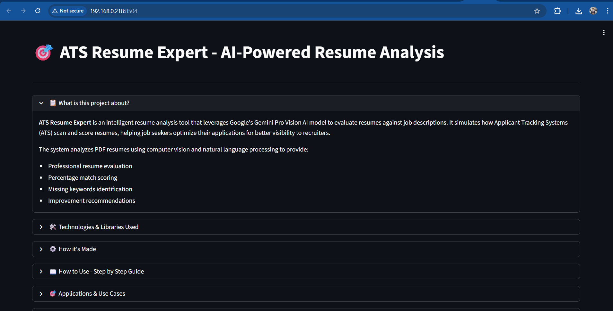
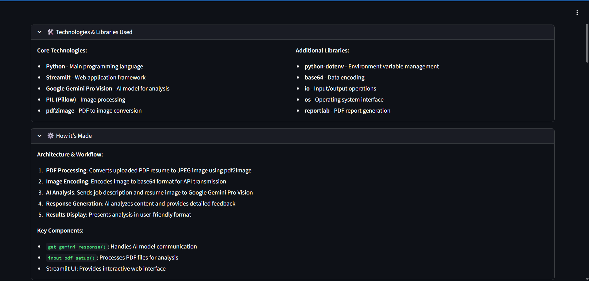
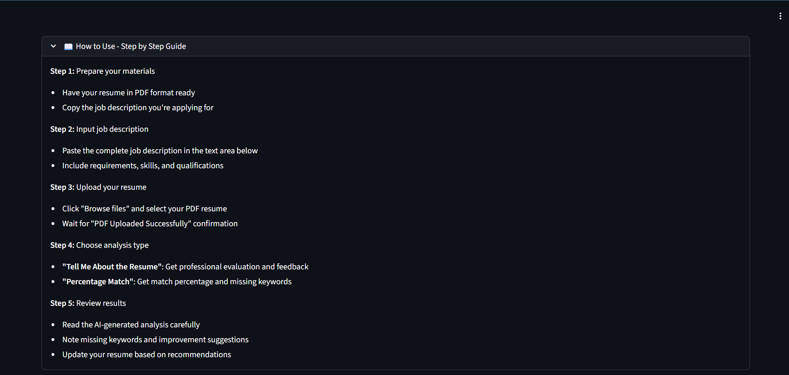

# 🎯 ATS Resume Expert - AI-Powered Resume Analysis


## 📋 What is this project about?

**ATS Resume Expert** is an intelligent resume analysis tool that leverages Google's Gemini Pro Vision AI model to evaluate resumes against job descriptions. It simulates how Applicant Tracking Systems (ATS) scan and score resumes, helping job seekers optimize their applications for better visibility to recruiters.

### Key Features:
- 🔍 **Professional resume evaluation**
- 📊 **Percentage match scoring**
- 🔑 **Missing keywords identification**
- 💡 **Improvement recommendations**
- 📄 **PDF report generation**
- 🤖 **AI-powered analysis using Google Gemini Pro Vision**

## 🛠️ Technologies & Libraries Used

### Core Technologies:
- **Python** - Main programming language
- **Streamlit** - Web application framework
- **Google Gemini Pro Vision** - AI model for analysis
- **PIL (Pillow)** - Image processing
- **pdf2image** - PDF to image conversion

### Additional Libraries:
- **python-dotenv** - Environment variable management
- **base64** - Data encoding
- **io** - Input/output operations
- **os** - Operating system interface
- **reportlab** - PDF report generation

## ⚙️ How it's Made

### Architecture & Workflow:

1. **PDF Processing**: Converts uploaded PDF resume to JPEG image using pdf2image
2. **Image Encoding**: Encodes image to base64 format for API transmission
3. **AI Analysis**: Sends job description and resume image to Google Gemini Pro Vision
4. **Response Generation**: AI analyzes content and provides detailed feedback
5. **Results Display**: Presents analysis in user-friendly format
6. **Report Generation**: Creates downloadable PDF reports

### Key Components:
- `get_gemini_response()`: Handles AI model communication
- `input_pdf_setup()`: Processes PDF files for analysis
- `generate_pdf_report()`: Creates downloadable PDF reports
- Streamlit UI: Provides interactive web interface

## 📖 How to Use - Step by Step Guide

### Step 1: Prepare your materials
- Have your resume in PDF format ready
- Copy the job description you're applying for

### Step 2: Input job description
- Paste the complete job description in the text area
- Include requirements, skills, and qualifications

### Step 3: Upload your resume
- Click "Browse files" and select your PDF resume
- Wait for "PDF Uploaded Successfully" confirmation

### Step 4: Choose analysis type
- **"Tell Me About the Resume"**: Get professional evaluation and feedback
- **"Percentage Match"**: Get match percentage and missing keywords

### Step 5: Review results
- Read the AI-generated analysis carefully
- Note missing keywords and improvement suggestions
- Download PDF report for future reference
- Update your resume based on recommendations

## 🚀 How to Run on Your PC

### Prerequisites
- Python 3.8 or higher
- Google API Key for Gemini Pro Vision

### Installation Steps

1. **Clone or Download the Project**
   ```bash
   git clone <repository-url>
   cd "Project 5 -ATS Using Google Gemini Pro Vision LIM Model"
   ```

2. **Create Virtual Environment (Recommended)**
   ```bash
   # Create virtual environment
   python -m venv venv
   
   # Activate on Windows
   venv\Scripts\activate
   
   # Activate on macOS/Linux
   source venv/bin/activate
   ```

3. **Install Required Libraries**
   ```bash
   # Install all dependencies
   pip install -r requirements.txt
   
   # Or install individually
   pip install streamlit python-dotenv Pillow pdf2image google-generativeai reportlab
   ```

4. **Set Up Environment Variables**
   - Create a `.env` file in the project directory
   - Add your Google API key:
   ```
   GOOGLE_API_KEY=your_google_api_key_here
   ```

5. **Run the Application**
   ```bash
   streamlit run app.py
   ```

6. **Access the Application**
   - Open your web browser
   - Navigate to `http://localhost:8501`
   - Start analyzing your resume!

### Getting Google API Key

1. Go to [Google AI Studio](https://makersuite.google.com/app/apikey)
2. Sign in with your Google account
3. Create a new API key
4. Copy the key and add it to your `.env` file

## 📸 Screenshots






## 🎯 Applications & Use Cases

### For Job Seekers:
- Resume optimization for specific roles
- ATS compatibility checking
- Keyword gap analysis
- Interview preparation

### For Recruiters:
- Quick resume screening
- Candidate-role fit assessment
- Standardized evaluation process
- Time-efficient hiring

## 🏢 Industry Applications

**Industries where ATS systems are widely used:**

- **Technology**: Software companies, startups, tech giants
- **Healthcare**: Hospitals, pharmaceutical companies, medical device firms
- **Finance**: Banks, investment firms, insurance companies
- **Consulting**: Management consulting, IT consulting firms
- **Manufacturing**: Automotive, aerospace, consumer goods
- **Retail**: E-commerce, fashion, consumer brands
- **Government**: Federal, state, and local government agencies
- **Education**: Universities, schools, educational technology companies

**Statistics**: Over 90% of Fortune 500 companies use ATS systems for initial resume screening.

## 🤝 Contributing

Contributions are welcome! Please feel free to submit a Pull Request.

## 📄 License

This project is licensed under the MIT License - see the LICENSE file for details.

## 🙏 Acknowledgments

- Google AI for providing the Gemini Pro Vision API
- Streamlit for the amazing web framework
- The open-source community for the excellent libraries used

---

**Built with ❤️ using Streamlit and Google Gemini Pro Vision AI**

*Helping job seekers optimize their resumes for ATS systems*
